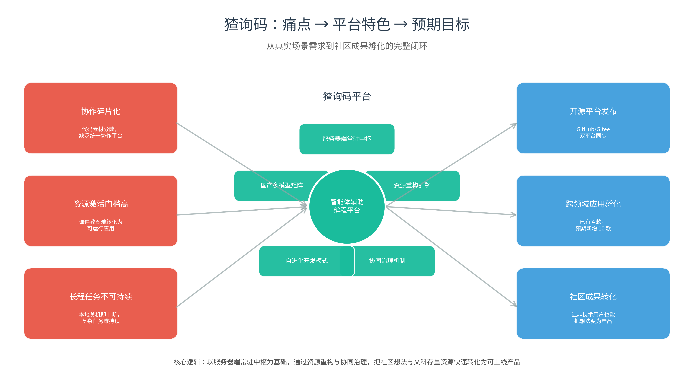

# 国家级大学生创新创业训练计划项目申报书

> **项目类型**：创新训练项目  
> **项目名称**：猹询码：面向团队协作与全栈项目管理的智能体辅助编程一体化平台

---

## 一、封面

| 项目 | 内容 |
|------|------|
| **推荐学校** | （学校公章） |
| **项目编号** | （待学校填写） |
| **项目名称** | **猹询码：面向团队协作与全栈项目管理的智能体辅助编程一体化平台** |
| **所属一级学科** | 信息与系统科学相关工程与技术 |
| **项目负责人** | 胡蕴秋 |
| **联系电话** | （手机号） |
| **指导教师** | 陈倩霞、（第二指导教师） |
| **联系电话** | （手机号） |
| **申报日期** | 2026 年 6 月 |

---

## 二、项目基本信息

| 项目 | 内容 |
|------|------|
| **项目名称** | 猹询码：面向团队协作与全栈项目管理的智能体辅助编程一体化平台 |
| **项目所属一级学科** | 信息与系统科学相关工程与技术 |
| **项目类型** | （√）创新训练项目&nbsp;&nbsp;&nbsp;（ ）创业训练项目&nbsp;&nbsp;&nbsp;（ ）创业实践项目 |
| **项目实施时间** | 起始时间：2026 年 9 月&nbsp;&nbsp;&nbsp;完成时间：2027 年 8 月 |

### 项目简介（100 字以内）

猹询码是一款面向团队协作与项目全生命周期管理的开源智能体辅助编程一体化平台。服务端作为 24 小时常驻的智能体中枢，提供平台管理、资源重构、可视化系统运维与分布式审计能力；客户端通过浏览器实现多端协同开发、一键上线与长程任务托管。项目在国产 Kimi CLI 基础上进行安全加固与架构重构，集成国产大模型矩阵，已实现自进化开发与多款应用落地。

---

## 三、申请理由

本项目组由 5 名成员组成，来自卓越学院经管类实验班、管理学院工商管理专业和外国语学院英语专业，具备项目思维、需求拆分与技术实现深度融合的跨学科优势。

**（一）项目缘起：从"一句话想法"到"可上线产品"的鸿沟**

项目需求源于两个真实场景中的切肤之痛。

**场景一：社区灵感到产品的极速转化。** 观猹平台上有用户随口提出一个脑洞："能不能把观猹上的产品、评价、讨论热度做成一个股市指数，每个产品都是一支个股，可以买入、卖出代表自己对产品的看好程度？"这个看似玩笑的想法，在常规开发流程中需要经历需求文档、技术选型、前后端开发、部署上线等漫长环节。但在猹询码平台上，团队仅用极短时间就将这一想法落地为"欸！股猹猹｜观猹概念股指实时追踪"应用并对外发布。这一案例让团队意识到：AI 时代不缺创意，缺的是把创意快速转化为可运行产品的平台化能力。

**场景二：文科教学资源的数字化困境。** 外国语学院教师积累了大量课件、教案、语料库等教学素材，长期希望以网页或教学程序的形式呈现，以提升课堂互动性与学生参与度。但由于缺乏技术背景，这些素材长期停留在文档形态，难以转化为可上线产品。团队使用猹询码平台，仅通过三轮自然语言输入，就针对某节综合英语课程构建了教师满意的教学网页。教师反馈："终于不用求技术团队，自己就能把想法变成学生能用的网页。"

这两个场景揭示了同一个问题：当前 AI 编程工具（如 Cursor、Claude Code、Kimi、DeepSeek 等）虽然能生成代码，但并未解决"团队协作、资源重构、长程任务、过程治理"等环节的完整闭环。具体而言，现有工具存在三重局限：

**其一，协作碎片化。** 成员各自在本地环境中开发，代码与素材分散，缺乏统一的平台承接多人协作与版本控制。

**其二，资源激活门槛高。** 通用大模型能回答编程问题，但无法把"沉睡的课件、教案、文档"系统性地重构为可运行的智能体或 Web 应用。

**其三，长程任务不可持续。** 复杂产品的单一阶段开发可能需要数小时甚至数天的持续迭代。本地设备关机，任务即告中断，开发者的想法被硬件可用性所束缚。

团队进一步调研发现，数字素材无法在 AI 时代被重新激活为可触及应用，是目前"新文科"背景下，尤其是文科院校面临的普遍痛点。这促使团队提出核心判断：当前市场缺少一个面向团队的、服务器端常驻的、能够把"沉睡素材"重构为"活跃应用"的多合一平台。该平台至少需要满足四项能力：降低用户的技术准入门槛，支持多人协作与过程治理，保障长程任务的连续性，以及实现全链路操作的可追溯与可审计。

基于此，团队确立了猹询码的核心使命：打造一款可管理、可重构、可治理的智能体辅助编程一体化平台，让知识和人才在 AI 时代真正释放潜力，让社区中的每一个想法都能被快速孵化。

**（二）在实践环境中锻炼的团队**

本团队由5名重视问题导向、实践能力强的成员组成，深耕学科交叉创新，并广泛接触真实需求。

**胡蕴秋**（未来企业家实验班）系统修习会计、金融、信息管理三大方向课程，兼具财务核算、投融资分析与信息化管理能力。擅长以平台全局视角拆分复杂需求，评估方案价值链与优先级。负责项目商业分析、竞品调研与用户需求分析，统筹项目整体资源协调，从财务、市场、数字化多维度为项目制定落地商业规划。

**陈镜宇**（英语专业）兼具语言现象理解与技术系统构建能力，围绕"语义流形"假说进行理论模型研究，并撰写如《语言游戏——从 Vibe Ability 到生成式 AI 的再评估》等回顾性研究报告，研学方向为计算语言学、语言哲学与人工智能哲学。具备从需求拆解到技术选型再到工程落地的全栈产品能力及企业实习经验，先后在杭电助手产品部、技术部任职，已负责一项浙江省大学生科技创新活动计划（新苗人才计划）项目的技术落地，为本项目提供方法论积累与训练基础。负责项目整体架构设计、核心功能模块开发、安全加固与代码审计，以及学术研究与论文撰写的主要工作。

**郭静俞**（英语专业）任职于校学生会与社团管理中心组织部，现任校英语协会会长，组织协调能力与跨学科项目对接经验丰富。具备对存量资源进行价值挖掘和再创作的能力，以及敏锐的语感与视觉表达能力，擅长从用户视角拆解交互逻辑。负责产品交互逻辑设计、用户调研与需求分析、前端界面原型设计，以及开源社区运营事务。

**杨博文**（英语专业）专业功底扎实，深耕外语综合应用与内容统筹，在校英语协会与学院学生会文企部任职期间积累了丰富的活动组织与多方对接经验，并任校级第二课堂系统校园文化部负责人，熟悉线上平台运维与数据统计流程。负责产品运营与用户增长、校内外推广渠道搭建，以及开源社区宣发事务。

**钟丽雯**（工商管理专业）擅长从管理视角统筹项目全局，具备协同治理、运营策略与资源整合能力。在课题组中接受系统性项目实践训练，习惯于以结构化思维拆解复杂任务、推动高效落地。负责协同治理机制设计、运营策略与资源整合，以及生态落地应用开发。

因此，项目团队拥有横跨平台管理、技术研发、产品设计、运营推广、协同治理的完整能力网络。成员均在各自擅长领域具备真实实践经历，同时能够理解相邻环节逻辑，面对跨学科问题时具备高效协作能力。

**（三）项目初版测试验证**

此前，猹询码平台的先行测试版本 "Cran Code" 已上线部署，并进入了第一版的"自进化"开发过程，积累了以下验证：

**平台基础已落地。** 猹询码已具备用户/团队/项目三级权限管理、AI 多轮会话、Web 前端、文件系统、Git 集成、多人实时代码协同编辑等核心功能。平台部署于公网服务器（阿里云香港区域），具备部分生产级能力。

**功能增强与安全加固过程中，形成可复用经验。** 在二次开发过程中，系统性修复了路径遍历、角色越权等多项安全隐患，形成规范 SOP，并创建为 Skills 再次置入猹询码中，可在后续开发中复用过程经验。

**孵化多款真实应用验证平台的社区成果孵化能力。** 猹询码不仅是一个开发工具，更是一个"想法→产品"的社区孵化平台。团队在平台上已孵化并上线：欸！股猹猹｜观猹概念股指实时追踪（由社区用户"股市指数"脑洞驱动，在观猹平台发布）、EduHelp（从 Python 与人工智能应用课程习题素材重构而来）、月雅湖畔毕业指南（从杭电 70 周年校庆文字素材重构而来的交互式文字模拟游戏）、The Man in Asbestos（从综合英语课程单元素材重构而来的教学网站）。这些应用覆盖了数据可视化、计算机教育、交互式游戏、课程教学四种典型场景，其共同特征是：均源自真实社区需求或存量教学资源，通过猹询码的资源重构与快速部署能力转化为可上线产品。这验证了平台为社区贡献成果孵化的核心价值——让非技术背景的师生与社区用户，也能把想法和资源快速变为可触及的数字产品。

**自进化开发与分布式留档。** 猹询码平台已进入"自进化"开发模式，即团队在猹询码平台协同下，对平台自身进行迭代，能够自动部署并同步 Gitee、GitHub 双平台。保留可视的全链路操作日志，确保每一次修改都可追溯、可复现。全程使用国产、开源产品，自主可控。

---

## 四、项目方案

### （一）项目研究背景

#### 1. 国内外同类产品发展现状及本产品研究意义

**（1）国际：Agentic Coding 产品已成为成熟的企业生产力工具**

2026 年全球 AI 编程市场规模达 128 亿美元，Agentic Coding 已成为新增付费的主要驱动力。Claude Code、Cursor、Codex 等产品验证了 AI 从"代码补全"到"自主任务执行"的范式迁移，但三者均局限于桌面端或单机 CLI 形态，且均为闭源或封闭生态产品，缺少面向服务器端常驻场景的功能设计，部分产品已明确对中国大陆及港澳地区断供。

**（2）国内：通用大模型与国产替代工具并行，但均非面向团队的完整平台**

国内层面存在两类主流工具，但均未能覆盖本项目的应用场景。

一类是通用 AI 对话与编程助手，如 Kimi、DeepSeek、通义千问、豆包等。它们的核心能力是基于大语言模型进行自然语言理解与代码生成，但其本质是"对话式顾问"而非"执行式平台"，存在四重局限：其一，**缺少实质性工程操作能力**，只能输出代码片段或建议，无法直接操作文件系统、执行 Git 版本控制、部署服务器、配置域名与 SSL，用户仍需在本地 IDE、终端、代码托管平台之间反复切换；其二，**缺乏项目级上下文管理能力**，每次对话相对独立，无法持续维护一个团队项目的完整代码库、依赖关系与部署状态；其三，**无法激活存量数字资产**，不能把沉淀的课件、教案、文档等文科素材系统性地重构为可运行的 Web 应用或智能体；其四，**不具备团队协作与长程运行能力**，不支持多人协同开发、操作审计与任务托管，更无法保证复杂任务在本地设备关机后继续推进。

另一类是国产 AI 编程工具，如 Trae、Qoder 等，但均为桌面 IDE 或 IDE 插件形态，缺乏服务器端长程 Agent 能力与平台级协作治理功能。此外，开源项目 MonkeyCode、OpenCode 开始涌现，但前者是 VS Code 插件形态，后者是单机 CLI，均非完整的 Web 管理与协作平台。

这些产品的共同局限在于：缺乏面向团队的、服务器端常驻的、具备全链路治理能力的整体方案。开发者仍需在本地 IDE、AI 对话、代码托管、服务器终端之间反复切换，长程任务因设备关机而中断，团队协作停留在"各自为战"的状态，大量文科场景下的"沉睡素材"无法被激活为可上线产品。

因此，市场上缺少一款面向团队的、服务器端常驻的、具备资源重构与协同治理能力的智能体辅助编程综合平台。本项目的研究意义体现在三个层面：其一，探索服务器端 Agentic Coding 的平台管理范式，为长程 AI 任务提供可持续运行的治理框架，丰富信息系统与运营管理交叉领域的实践案例；其二，降低团队数字资产重构成本，实现"资源管理→协同开发→自动部署→系统运维"的全链路平台化；其三，采用多项国产模型，为自主可控的软件开发工具链提供平台级参考，响应国产替代的战略需求。

#### 2. 项目已有基础

**（1）先行测试版本开发经验。** 如上所述，猹询码平台的先行测试版本"Cran Code"已完成部署并进入"自进化"开发阶段。开发过程中，团队将问题解决流程沉淀为规范 SOP，并封装为可复用的 Skills 置入平台，为后续持续"自进化"迭代提供方法论基础。

**（2）外部意向团队对接测试。** 基于先行版本在原创生态位中的差异化能力，项目已吸引多支外部团队参与测试与资源对接，覆盖非遗文化传承、数字绘本程序、外语学科教学、汉语国际教育、算法设计等多个领域，并提供"词元"资源支持。这些真实用户的开发使用记录与需求反馈，为平台迭代提供了直接的验证数据与优化方向。

#### 3. 尚缺少的条件及方法

**（1）大规模团队并发验证。** 当前尚未完成大规模团队并发使用场景的测试，后续需邀请部分对接团队进行试点，收集并发场景下的运行数据并迭代优化。

**（2）监控治理模块。** 先行版本尚未开发该模块，后续将在第一个大版本迭代中设计轻量级任务看板与审计面板。

**（3）开源社区生态建设。** 先行版本已在 GitHub、Gitee 等平台开源，但尚未建立完整的贡献者体系与社区运营机制，后续将持续完善文档与贡献指南，引入外部反馈和外部贡献者参与。

### （二）项目研究目标及主要内容

#### 1. 项目研究目标

**（1）平台建设目标：** 打造服务器端常驻的智能体辅助编程一体化平台，覆盖平台管理、协同开发、自动部署、系统运维治理。

**（2）资源重构目标：** 实现存量数字素材（文档、课件等）向 AI 智能体、现代 Web 应用的高效重构与价值激活。

**（3）协同治理目标：** 构建可追溯、可审计、可复现的团队协作机制，实现分布式留档与过程治理。

**（4）开源推广目标：** 形成可私有化部署的开源方案，建立外部用户可参与代码贡献与需求反馈的可持续社区生态，并在开源社区形成一定影响力。

#### 2. 项目主要内容

项目致力于实现以下主要功能模块。

**表 1 产品模块及核心能力**

| 模块 | 核心能力 |
|------|----------|
| 平台管理 | 用户/团队/项目三级权限、资源空间治理、配置管理 |
| 资源重构 | 旧素材导入、网页/应用一键构建 |
| Vibe Coding | 自然语言驱动的低门槛编程辅助、图形化与专业功能平衡 |
| 协同编辑 | 多人实时协同、AI 辅助、版本治理、审计批注 |
| 长程 Agent | 服务器常驻、自动化任务推进 |
| 快速部署上线 | 项目一键发布、域名自动配置、SSL 管理 |
| 运维治理 | 系统状态监控、操作日志审计、任务可视化追踪 |
| 国产模型矩阵 | 长程编程模型与多模态/超长上下文模型协同 |

### 项目核心逻辑图

*图 1 猹询码项目核心逻辑：以服务器端常驻中枢为基础，通过资源重构与协同治理，把社区想法与文科存量资源快速转化为可上线产品。*

### （三）项目创新特色概述

#### 1. 架构创新：服务器端常驻的 Agentic Coding 中枢

区别于 Cursor（桌面 IDE）、Claude Code（单机 CLI）等既有产品，猹询码将 Agentic Coding 中枢部署在服务器端，实现任何设备通过客户端即开即用、本地关机任务不中断、团队资源集中治理。这一架构填补了当前市场上"服务器端常驻 + 即开即用 + 团队协作原生"的平台级空白，为长程 Agent 任务提供了可持续运行的物理基础。

#### 2. 资源重构创新：存量数字资产的激活引擎

面对大规模存量数字资产（课件、教案、文档等），猹询码提供从素材导入到智能体/网页/应用生成的一体化重构能力，让存量资源在 AI 时代重新产生价值，直接回应"新文科"背景下文科数字资产激活的普遍痛点。

#### 3. 协同治理创新：全链路可追溯的协作机制

全链路操作日志与版本审计机制确保团队每一次修改、每一次 Agent 操作都有据可查。分布式留档设计确保数据安全与治理透明，形成"操作即留痕、留痕即治理"的闭环，为教育与企业场景的平台管理提供可复用的治理范式。

#### 4. "自进化"开发模式：平台参与自身迭代

猹询码已进入"自进化"开发阶段，团队使用平台协同迭代平台自身，自动部署并同步多个代码托管平台。这种"自举"能力验证了平台的可用性，并形成持续迭代的正反馈循环，降低了对外部开发环境的依赖，提升了版本迭代的可控性。

#### 5. 国产多模型协同矩阵：自主可控的模型调度能力

平台集成国产长程编程模型、多模态/超长上下文模型与音视频生成模型，形成国产模型协同矩阵。根据任务类型，Coding Agent 可自主灵活调度不同模型能力，规避对闭源国外模型生态的依赖，在国产替代背景下具备明确的战略价值。

### （四）项目研究技术路线与研究进度安排

本项目的技术路线遵循"快速验证→架构解耦→生态融合→成果固化"的递进策略。基于先行版本已有的功能基础，第一阶段以 Kimi CLI 为底座完成核心能力收敛与外部验证；随后通过两次架构重构，逐步实现服务端与客户端分离、多节点自由组合，并正式接入观猹生态；最终阶段聚焦性能调优与知识产权固化。

**表2 开发路线表**

| 阶段 | 时间轴 | 核心能力 |
|:---|:---|:---|
| 阶段1：功能收敛与验证 | 2026.09 | 基于 Kimi CLI 二次开发，完善平台管理、资源重构、协同编辑等核心功能；完成安全加固与治理规范沉淀；开展外部意向团队试点验证 |
| 阶段2：第一次架构重构 | 2026.10–12 | 服务端与客户端分离，实现独立演化；长程 Agent 常驻调度与自动化任务推进；国产多模型矩阵协同接入；多客户端适配验证 |
| 阶段3：第二次架构重构与生态接入 | 2027.01–06 | 多服务端、多客户端自由组合架构落地；正式接入观猹生态与观猹登录体系；性能优化与扩展机制设计；开源文档完善与社区运营 |
| 阶段4：性能改进与成果固化 | 2027.07–08 | 全链路性能调优与稳定性提升；知识产权申请与学术论文撰写；创新大赛参赛与成果展示；结题报告整理与后续规划 |

---

## 五、项目组成员分工

| 姓名 | 合作成员及内容 | 专业优势 |
|------|----------------|----------|
| 胡蕴秋 | 1. 商业分析与竞品调研 2. 用户需求分析 3. 项目整体资源协调 4. 财务与市场规划 | 卓越学院未来企业家实验班，会计/金融/信息管理复合背景，平台管理与商业分析能力 |
| 陈镜宇 | 1. 项目整体架构设计 2. 核心功能模块开发 3. 安全加固与代码审计 4. 学术研究与论文撰写 | 外国语学院英语专业，计算语言学/语言哲学/AI 哲学研究背景，全栈开发能力 |
| 郭静俞 | 1. 产品交互逻辑设计 2. 用户调研与需求分析 3. 前端界面原型设计 4. 开源社区运营 | 外国语学院英语专业，现任校英语协会会长，跨学科对接与用户需求洞察能力 |
| 杨博文 | 1. 产品运营与用户增长 2. 校内外推广渠道搭建 3. 开源社区宣发 4. 项目展示与路演 | 外国语学院英语专业，校级第二课堂系统负责人，平台运维与传播推广能力 |
| 钟丽雯 | 1. 协同治理机制设计 2. 运营策略与资源整合 3. 生态落地应用开发 4. 项目进度管理 | 管理学院工商管理专业，课题组系统实践训练背景，协同治理与资源整合能力 |

---

## 六、学校提供条件

### （一）资源支持

学校图书馆提供中国知网（CNKI）、IEEE Xplore、ACM Digital Library 等中外文数据库，支持文献追踪与行业调研。

### （二）实验环境

计算机实验中心提供 Linux 服务器、GPU 计算资源与网络环境；创新创业学院可提供云服务资源补贴。

### （三）指导支持

指导教师陈倩霞长期从事在线平台、数据挖掘、数字经济、智能决策等研究，主持国家自然科学基金青年项目、教育部人文社科青年基金项目、浙江省自然科学基金青年项目等多项纵向课题，拥有大语言模型教学系统相关发明专利成果，主持校级教改项目与"人工智能+教学创新"示范课程，能够为本项目在研究设计、数据分析、成果凝练、论文写作和专利申请等方面提供有力指导。

### （四）人才支持

团队成员来自英语、经管、工商管理等多学科，具备语言理解、平台管理、商业分析、产品设计、传播运营等综合能力，形成"人文—技术—管理"的互补结构。

---

## 七、预期成果

### （一）核心数字化产品

1. **猹询码智能体辅助编程一体化平台 v1.0**：完成开源发布，覆盖平台管理、资源重构、Vibe Coding、协同编辑、长程 Agent 常驻、自动部署、运维治理等八大核心模块；
2. **私有化部署方案**：提供容器化部署脚本与配置模板，任何 Linux 服务器可在 30 分钟内完成私有化部署，满足教育与企业内网的合规需求；
3. **平台孵化应用矩阵**：在已有 4 款应用（股猹猹、EduHelp、1956、综英网站）基础上，预期新增 10 款跨领域应用，覆盖非遗数字化、国际汉语教育等场景，验证平台泛化支撑能力。

### （二）知识产权与学术成果

1. **软件著作权**：申请 1 项（猹询码智能体辅助编程一体化平台），覆盖平台核心代码与架构设计；
2. **开源仓库**：GitHub/Gitee 双平台同步 Release v1.0，含完整技术文档、部署指南与扩展开发参考；
3. **技术白皮书**：《服务器端 Agentic Coding 平台管理指南》1 份，系统沉淀"资源重构—协同治理—自进化迭代"的平台管理范式与最佳实践；
4. **学术论文**：撰写并投稿 1 篇，方向为平台管理、信息系统或教育技术领域（SSCI/CSSCI 或中文核心期刊），提炼服务器端 Agentic Coding 的治理框架与实证经验。

### （三）竞赛参与与社会效益

1. **创新竞赛**：积极筹备并参加"互联网+"大学生创新创业大赛、"挑战杯"、中国大学生服务外包创新创业大赛等省级以上赛事；
2. **开源社区触达**：平台开源后预期覆盖 200+ 开发者与团队，降低中小企业及高校团队的开发工具链建设门槛，推动 Agentic Coding 技术的普惠化应用；
3. **国产替代贡献**：国产多模型协同矩阵方案为自主可控的 AI 编程工具链提供平台级实践参考，减少对单一闭源国外模型的依赖；
4. **治理范式输出**：全链路操作日志与分布式审计机制形成可复用的协同治理方案，为教育、企业等场景的平台管理提供"操作即留痕、留痕即治理"的范式借鉴。

---

## 八、经费预算

| 总经费 | 10000 元 |
|--------|----------|
| 财政拨款 | 5000 元 |
| 学校拨款 | 5000 元 |

> 具体预算明细按学校财务规定填写。

---

## 九、导师推荐意见

（待指导教师填写）

签名：_______________&nbsp;&nbsp;&nbsp;_______________

日期：_______年_______月_______日

---

## 十、院系推荐意见

（待院系负责人填写）

院系负责人签名：_______________

学院盖章：_______________

日期：_______年_______月_______日

---

## 十一、评审专家组意见

（待评审专家组填写）

负责人签名：_______________

日期：_______年_______月_______日

---

## 十二、学校推荐意见

（待学校填写）

学校负责人签名：_______________

学校公章：_______________

日期：_______年_______月_______日

---

## 附录：快速替换清单

| 占位符 | 替换内容 |
|--------|----------|
| （学校公章） | 学校全称 |
| （手机号） | 项目负责人/指导教师电话 |
| （第二指导教师） | 如有第二指导教师则填写，无则删除 |

---

*本申报书基于"数智绘美"样例结构撰写，已根据猹询码项目实际信息与系统科学相关工程与技术定位及服务器端智能体辅助编程一体化平台属性进行了针对性调整。*
